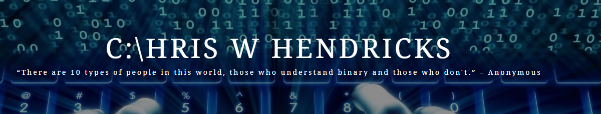

    

    
  

### About Me 

    

My name is Chris Hendricks. I live in the Great State of Michigan were I have lived my entire life. I have been writing software in some capacity for more than 20 years.

I first started dabbling in the art of programming when I was about 12 years old on my Commodore 64. 
In High School I took some Turbo Pascal and C classes, and it was during this time that I realized I had a love for coding and that this was what I was going to do with my life.

I am 43 years old and have been married to my wife Pam for almost 17 years.  
I have 5 Children who keep me quite busy: Maggie(19), Luke(15), Alexandria(11), Liliana(9), Evangeline(2)

In my spare time I like to Boat, Wakeboard, Watch Football, and spend time with my family.

### 🔥 My Stats

### :hammer_and_wrench: Languages and Tools :  

   
   
   
   
   
  
 

