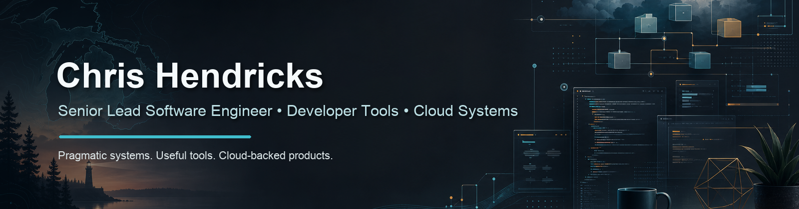

  

  
  
  

## About

I'm Chris Hendricks, an AI Engineer in Michigan with more than two decades in public safety technology. I build practical AI systems, developer tools, and cloud-backed products with an emphasis on useful context, clear architecture, and technology that makes a real-world difference.

My work spans applied AI, agentic systems, .NET, TypeScript, Python, AWS, Git workflows, and the tooling that helps engineering teams move faster without losing sight of the people and problems behind the software.

Away from the keyboard, I'm a father of five, spend as much time as I can on Lake St. Clair, fish when the opportunity presents itself, and keep experimenting with personal projects like Ghostwheel.

> *I find your lack of context disturbing.*

## Current Focus

  
  
  
  
  
  
  

## Featured Project: Ghostwheel

**Ghostwheel** is my local-first AI companion project, exploring how AI can become a calm, ambient presence rather than just another app. It brings together conversational AI, memory, voice, presence, task and knowledge workflows, and physical-device experimentation across desktop, Raspberry Pi, and ESP32 hardware.

The project is intentionally privacy-minded and local-first where practical, with a distributed architecture spanning a Tauri desktop application, Rust services, local models and cloud AI, voice interfaces, sensors, displays, and ambient hardware. The repository is currently private while the architecture evolves.

## Selected Work

| Project | What it is | Stack |
| --- | --- | --- |
| [DevShelf](https://github.com/ChrisWHendricks/devshelf) | Local dashboard for browsing git repositories, pull requests, and Markdown documentation without a cloud service or database. | Python, FastAPI, Alpine.js |
| [Dadonomics v2](https://github.com/ChrisWHendricks/hendricks-money) | Personal budget management app with local mock mode, AWS-backed environments, account tracking, budgets, goals, and CSV import. | React, TypeScript, AWS Amplify |
| [dotfiles](https://github.com/ChrisWHendricks/dotfiles) | Cross-platform dotfiles manager with safe symlink handling, tool installation, checks, dry runs, and machine bootstrap support. | Python, Click, Shell |

## GitHub

  
  

## Engineering Stack

  
  
  
  
  
  
  
  
  
  

