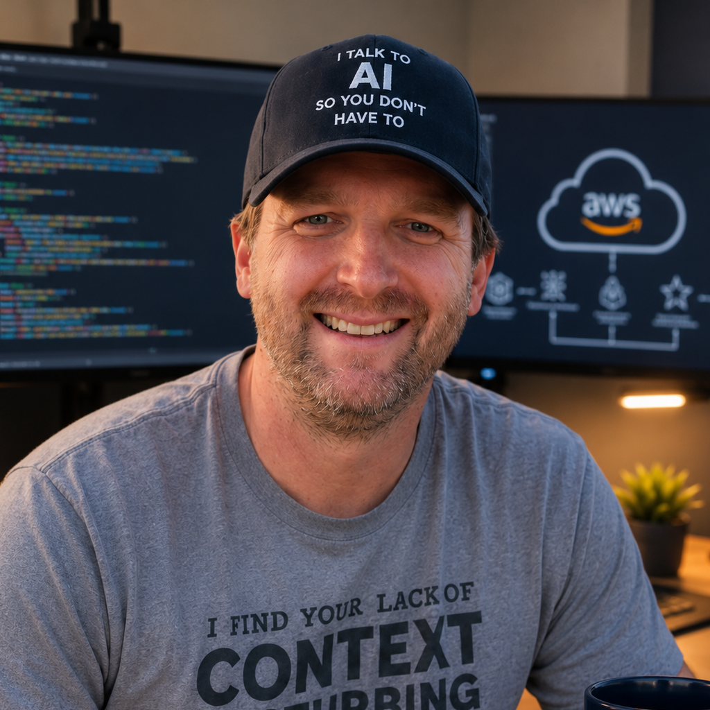

**Senior Lead Software Engineer at [Tyler Technologies](https://github.com/tyler-technologies).**

Two decades in public safety technology — which is a long time to spend making sure a screen loads correctly for someone having the worst day of their life. It's excellent training. Nothing teaches you to distrust clever architecture faster than a dispatcher on the phone at 2am.

These days most of my work is applied AI and agentic systems: LLM pipelines, retrieval that retrieves the right thing, MCP servers, and the developer tooling that makes a team faster without a rewrite. I care more about what survives a Tuesday in production than what demos well on a Thursday.

The hat is not ironic. The shirt is load-bearing.

> *I find your lack of context disturbing.*

---

## Currently

- **Ghostwheel** — a local-first AI companion. Memory, voice, presence, ambient hardware. Deliberately not another chat window.
- **Agentic tooling** — MCP servers and retrieval layers, because most "the model is dumb" problems are context problems.
- **Small sharp tools** — DevShelf, dotfiles, and whatever else makes my own week quieter.

## Ghostwheel

An experiment in AI as a calm, ambient presence rather than an app you open. Conversational AI with real memory, voice and presence, task and knowledge workflows — spread across a Tauri desktop app, Rust services, local models alongside cloud AI, and a rotating cast of Raspberry Pi and ESP32 boards in various states of half-solder. Privacy-minded and local-first wherever it's practical, which is more often than the industry admits. Private repo while the architecture argues with itself.

## Selected work

| Project | What it is | Stack |
| --- | --- | --- |
| [**DevShelf**](https://github.com/ChrisWHendricks/devshelf) | Local dashboard for git repos, pull requests, and Markdown docs. No cloud service, no database, no subscription. | Python · FastAPI · Alpine |
| [**Dadonomics v2**](https://github.com/ChrisWHendricks/hendricks-money) | Budgeting for a household of seven. Accounts, budgets, goals, CSV import, and a local mock mode so I can break it safely. | React · TypeScript · Amplify |
| [**dotfiles**](https://github.com/ChrisWHendricks/dotfiles) | Cross-platform machine bootstrap with safe symlinks, dry runs, and checks that fail loudly instead of politely. | Python · Click · Shell |

## Stack

**AI** — LLM systems · agents · RAG · MCP · OpenAI & Anthropic APIs · local models
**Build** — C# · .NET · TypeScript · React · Python · FastAPI · Rust · Tauri
**Run** — AWS · Amplify · Git workflows · shell · Raspberry Pi & ESP32

## GitHub

*Most of the interesting work lives behind a private repo or a customer's firewall, so grade the charts accordingly.*

---

## Away from the keyboard

Father of five, which is its own distributed system — eventual consistency, no rollback. As much time on the water as Michigan weather allows, a workbench of half-finished hardware, and kids who volunteer as the harshest QA available.

Faith and family come first here, and the ordering shows up in what I choose to build: software for people on the worst day of their lives, made by someone who thinks that work is worth doing carefully.

[chriswhendricks.com](https://chriswhendricks.com) · [LinkedIn](https://www.linkedin.com/in/chriswhendricks) · [X](https://x.com/ChrisWHendricks)
